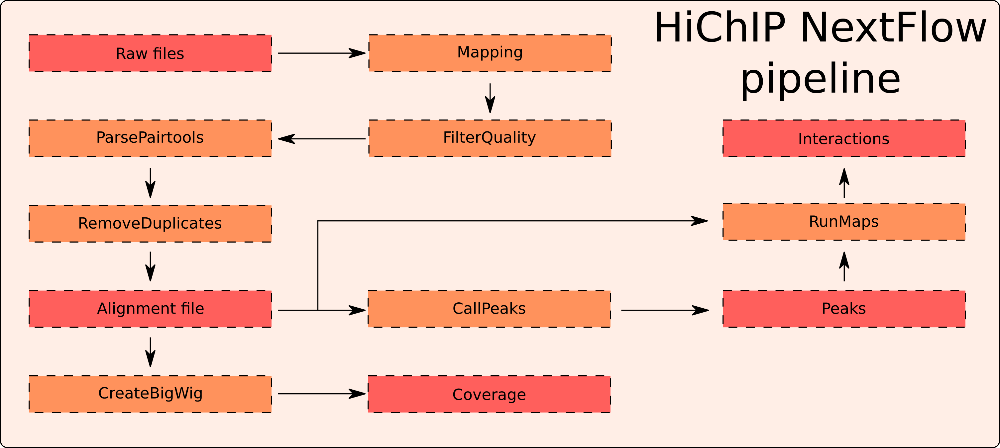

# HiChIP Nextflow Pipeline
Pipeline for processing HiChIP data.

The pipeline is presented on the following figure:



To use the pipeline, you need to have nextflow installed.

To run, use command: 

```nextflow run main.nf --design design.csv```

Example design.csv file:

sample | fastq_1 |fastq_2 | replicate |
-- | ------ |------ | ------ |
S1 | /data/SAMPLE1_1_R1.fastq.gz | /data/SAMPLE1_1_R2.fastq.gz | 1
S1 | /data/SAMPLE1_2_R1.fastq.gz | /data/SAMPLE1_2_R2.fastq.gz | 2
S2 | /data/SAMPLE2_1_R1.fastq.gz | /data/SAMPLE2_1_R2.fastq.gz | 1
S2 | /data/SAMPLE2_2_R1.fastq.gz | /data/SAMPLE2_2_R2.fastq.gz | 2

